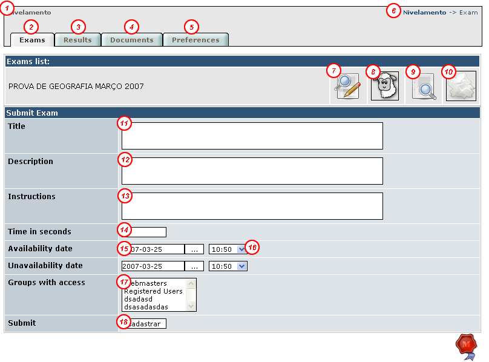
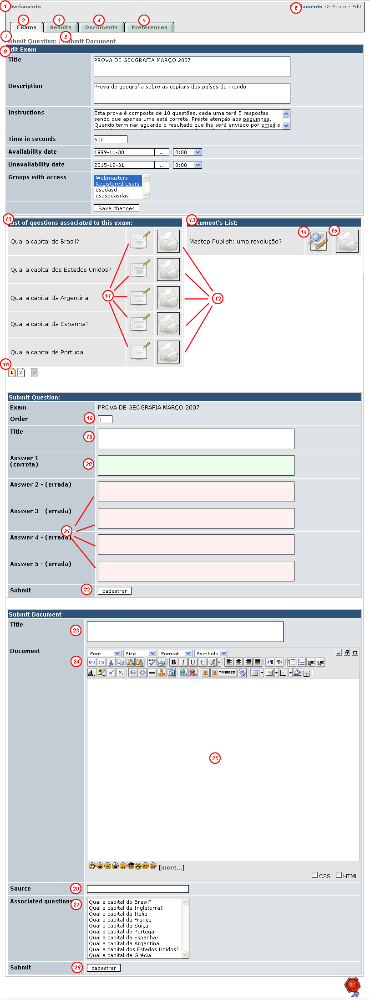

# 4.0 Operating Instructions
##Creating a test

The first step to be taken to create an interaction between the student and the teacher is the creation of proof. No evidence established there is no way the student have a result which seems obvious.

####4.a Cadastrando os dados da prova em si

To understand how the module works there to understand some terms. The test consists of questions, documents, results and own attributes. The first thing to do to create the proof is registering the very attributes this. See the registration screen and their explanation:

*Creation screen of the main attributes of the test*

Item 1: A direct link to the student, where the student finds the evidence.

Item 2: A link to the current page where you create, edit, clone and excludes evidence, and you can see the results of a test determianda.

Item 3: Links to the screen that allows you to access the results of all the confused evidence.

Item 4: A link to the screen that allows you to access the documents of all the confused evidence

Item 5: Links to the settings page view on the topic 3 of this tutorial

Item 6: A text that is for you to lie on the amdinsitração, it indicates where you are. (Breadcrumps)

Item 7: Link that lets you edit the test. In addition to editing the main attributes of proof you have access To the screen to edit and register both documents as questions.

Item 8: Link that allows you to "clone" a test. Clone proof means copying beyond the test attributes, all your documents and all of your questions. It notes that the allocation of documetos questions is not copied and must be performed manually.

Item 9: Displays a screen with all the results of that test in particular and some statistical data as higher note, middle note ...

Item 10: Delete the test. This operation requires confirmation because it goes beyond the test attributes, all questions, answers, documents and results related to that test.

Item 11: Summary of evidence. Field to set up a title for the test. eg GEOGRAPHY TEST

Item 12: Fields for registration of the description of the test. Information perhaps on the subject that is being checked.

Item 13: Field to register instructions of proof. I suggest you put all the rules here (weather proof, if proof is with or without consultation etc ...)

Item 14: test of time in seconds. Once students begin to test how long it has before she shut herself?

Items 15 and 16: These fields allow you to set the day and time of beginning and end of dosponibilização of proof. Before the student can not take the test and then did not. Click the button to view the calendar.

Item 17: Groups can take the test. While preparing the evidence does not place any group or else change the previous option that the proof is not made available to the student. The risk is the student to take the test before it is ready.

Item 18: Button to send the data of the attributes of the evidence.

####4.b Cadastrando the test questions

Once you have registered the basic data of the race you can register the the test questions. To do this on the screen that opens after sending the data of the test attributes (you can reach this window also through the item edit proof in explained window in the previous step) Click the link to question registration or scroll the scroll bar on the side of your browser to the question of registration form. This form has 7 fields as shown below. Fill them and send your inquiry. Repeat as often as necessary. Here I think only we highlight the field order that is important in the sense that it allows you to set the order in which the questions will be given in evidence.

####4.c Registering the documents of test

The documents you will register on the module should serve as a reference for some questions. Questions for example the interpretation of text, so require functionality. To access the submission form of this information click send documents or scroll right scroll bar of your browser to find it. The form displays beyond their basic fields (detailed below) a field where you can choose with the left mouse button and ctrl pressinados while the questions that will present this question before.

*Editing window*

Items 1 to 6: View topic 4.a this tutorial.

Item 7: Link to anchor the questions of registration form

Item 8: Link to anchor the document registration form

Item 9: Form to edit basic data attributes, doubts report to topic 4.a

Item 10: List of test questions displayed

Item 11. Link to edit the data of a question

Item 12: Link to delete a question of proof (the associdas responses are also deleted)

Items 13,14,15: 10,11,12 Similar to items only for documents

Item 16: Navigation Bar Questions

Item 17: There is this item: D

Item 18: Field for the question order. This field should be an integer. The lower before the question will come in the race and the higher later the question will come in the race.

Item 19: Question Title field: eg What is the capital of Italy

Item 20: Correct Answer

Item 21: Incorrect Answers

Item 22: the question register for Button

Item 23: Document title

Item 24: ferramento bar text editor

Item 25: test text. You can copy the word or text from the internet and paste here in this editor that he would save the frmatação (in the case of koivi)

Item 26: If a text from the internet text font

Item 27: What questions should submit the document text before them? Use the CTRL while clicking the questions to choose more than one. To deselect one Clicque it again (always with tight ctrl at the same time)

Item 28: Button for registering the document

####4.d Providing test for users

Now just remember to update the attributes of test to release it to users. Set the date and or groups and go!

