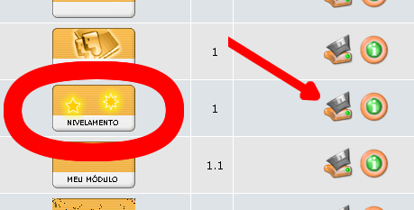
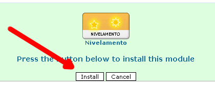
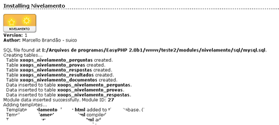

# 1.0 Instalando o módulo

No special measures necessary, follow the standard installation process - extract the module folder into the 

/modules 

directory in your XOOPS installation. Install the module through Admin -> System Module -> Modules.

Detailed instructions on installing modules are available in the [**Chapter 2.12 of our XOOPS Operations Manual**](https://www.gitbook.com/book/xoops/xoops-operations-guide/)

2.a Onde baixar

A primeira coisa a ser realizada é baixar o módulo em um dos sites de suporte ao xoops. 
Inicialmente estarei colocando pelo menos em 3: xoops.org xoopstotal.com.br e xoops.pr.gov.br .
2.b Dependências:

Segunda coia a se fazer é verificar se você já possui na sua máquina dois pacotes opcionais do xoops que considero importantes: Frameworks do phppp 1.1 ou superior e class/xoopseditor 1.10 ou superior. O primeiro é responsável por várias funções de segurança do módulo e umas utilidades que permitem dar "uma carinha bonita" à administração. O segundo Permite usar um editor de textos muito semelhante ao word (este tipo de editor é chamado WYSIWYG). Você pode baixar eles aqui:
Link para o Frameworks
Link para o xoopseditor

2.c Instalando

Coloque a pasta nivelamento dentro de /modules/, a pasta do Frameworks (sim com maiúscula) na raiz do site e a pasta xoopseditor dentro de /class/. Entre como administrador no site e vá na área reservada ao administrador e no módulo system admin escolha a opção modules. 
Duas listas de módulos irão aparecer. A primeira é a dos módulos já instalados, a segunda é a dos módulos ainda não instalados. É nesta segunda lista que estará o módulo nivelamento. clique no botão instalar conforme imagem abaixo.

Clique na no ícone de instalação

Agora se tudo correu bem uma tela de confirmação irá se estamapar na tela parecendo com a imagem abaixo:

Confirmação do desejo de instalar este módulo

Novamente se tudo correu bem , uma tela com o log de tudo que foi realizado vai se apresentar. Algo como esta abaixo:

Log de texto da instalação
Pronto o seu módulo foi instalado com sucesso e você pode ir criar sua primeira prova ou prestar a prova de exemplo sobre as capitais do mundo que vem já instalada.