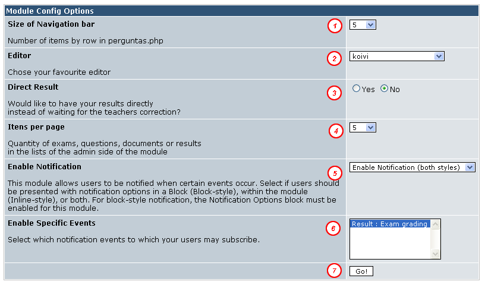

# 3.0 Configurando para as suas necessidades

Nivelamento permite que você o ajuste para diversas finalidades e de acordo com estas você deverá ajustar alguns parâmetros. Para alterar os parâmetros do módulo simplesmente vá no menu preferências do módulo de nivelamento. A página abaixo irá se abrir. Configure-a conforme suas necessidades.

Tela de preferências

Item 1: Na tela de perguntas você possui uma barra de navegação que permite que você navegue entre as diferentes perguntas da prova marcando aquelas que o aluno já respondeu. Quantos itens vão aparecer nessa lista antes de quebrar a linha é definido neste item. Isto permite que você use o Nivelamento em qualquer resolução.

Item 2: O editor dos documentos pode ser tanto um editor simples como pode ser um editor elaborado que permite inserir até mesmo videos do youtube. Eu recomendo que usem o editor koivi por ser este o recomendado pela equipe xoops.org, porém eu sugiro também que testem o mastop_publish que vai em anexo dentro da pasta extras por possuir mais funcionalidades e ser feito por um brasileiro (topet05)

Item 3. Quando o aluno termianr de fazer a prova ele pode tanto ter que aguardar por um sinal verde do professor informando que o resultado já saiu, como ele pode ter o resultado imediatamente. Tudo vai depender de seu caso de negócio. As vezes é interessante que o aluno só saiba de sua nota em uma data específica mais tarde, outras vezes é ele precisa saber imediatamente. Vamos ver o que é emlhor no seu caso.

Item 4. Na parte da administração existem várias listas que exibem perguntas documentos provas e resultados. Aqui você define quantos itens devem aparecer por página. Recomendo o uso de 5 mesmo, por não pesar para o servidor.

Item 5. Esta é conhecida dos usuários xoops. Aqui você define se quer ou não que os alunos possam escolher de serem comunicados de que o resultado de sua prova saiu.

Item 6. Esta também é conhecida dos xoopers. Neste item de configuração você escolhe quais eventos estão habilitados. No caso de nosso módulo por enquanto apenas um evento existe portanto não tem muito sentido , mas quem sabe na próxima versão.